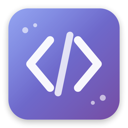

<p align="center">
  
</p>

<h1 align="center">Code Editor</h1>

<p align="center">
  A lightweight, fast, cross-platform code editor built with Tauri, Svelte 5, and CodeMirror 6.
</p>

<p align="center">
  <a href="#features">Features</a> •
  <a href="#installation">Installation</a> •
  <a href="#keyboard-shortcuts">Shortcuts</a> •
  <a href="#development">Development</a> •
  <a href="#license">License</a>
</p>

---

## Features

### Editor
- **Syntax Highlighting** - Support for 20+ languages (JavaScript, TypeScript, Rust, Python, Go, PHP, and more)
- **Multiple Tabs** - Work with multiple files simultaneously
- **Dark/Light Themes** - Beautiful Tokyo Night theme
- **Zoom Controls** - Adjustable font size with keyboard shortcuts

### File Management
- **File Tree** - Visual file explorer with colored folder icons
- **Quick Open** - Fast file search with `Cmd+P`
- **New File Dialog** - Create files from templates (React, Vue, Svelte, PHP, Python, etc.)
- **Context Menu** - Right-click actions for files and folders

### Search
- **Find in File** - `Cmd+F` for in-file search
- **Find in Project** - `Cmd+Shift+F` for global search across all files
- **Go to Line** - `Cmd+G` to jump to specific line

### Terminal
- **Integrated Terminal** - Built-in terminal with PTY support
- **Resizable** - Drag to resize terminal panel

### UI
- **Menu Bar** - File, Edit, View, Go dropdown menus
- **Sidebar** - Toggle with `Cmd+B`
- **Command Palette** - `Cmd+Shift+P` for quick commands
- **Status Bar** - File info, cursor position, language mode, zoom controls

## Installation

### Download

Download the latest release for your platform from [Releases](https://github.com/sirserik/code-editor/releases).

### Build from Source

#### Prerequisites

- [Node.js](https://nodejs.org) (v18+)
- [Rust](https://rustup.rs)
- [Tauri Prerequisites](https://tauri.app/v1/guides/getting-started/prerequisites)

#### Build

```bash
# Clone the repository
git clone https://github.com/sirserik/code-editor.git
cd code-editor

# Install dependencies
npm install

# Run in development mode
npm run tauri dev

# Build for production
npm run tauri build
```

The built app will be in `src-tauri/target/release/bundle/`.

## Keyboard Shortcuts

| Action | macOS | Windows/Linux |
|--------|-------|---------------|
| New File | `Cmd+N` | `Ctrl+N` |
| Open File | `Cmd+O` | `Ctrl+O` |
| Open Folder | `Cmd+Shift+O` | `Ctrl+Shift+O` |
| Save | `Cmd+S` | `Ctrl+S` |
| Close Tab | `Cmd+W` | `Ctrl+W` |
| Quick Open | `Cmd+P` | `Ctrl+P` |
| Command Palette | `Cmd+Shift+P` | `Ctrl+Shift+P` |
| Find in File | `Cmd+F` | `Ctrl+F` |
| Find in Project | `Cmd+Shift+F` | `Ctrl+Shift+F` |
| Go to Line | `Cmd+G` | `Ctrl+G` |
| Toggle Sidebar | `Cmd+B` | `Ctrl+B` |
| Toggle Terminal | `` Cmd+` `` | `` Ctrl+` `` |
| Zoom In | `Cmd+=` | `Ctrl+=` |
| Zoom Out | `Cmd+-` | `Ctrl+-` |
| Reset Zoom | `Cmd+0` | `Ctrl+0` |

## Tech Stack

| Component | Technology |
|-----------|------------|
| Frontend | [Svelte 5](https://svelte.dev) + TypeScript |
| Editor | [CodeMirror 6](https://codemirror.net) |
| Backend | [Tauri 2](https://tauri.app) (Rust) |
| Terminal | [xterm.js](https://xtermjs.org) |
| Theme | Tokyo Night |

## Development

### Project Structure

```
code-editor/
├── src/                          # Frontend (Svelte)
│   ├── lib/
│   │   ├── components/           # UI components
│   │   ├── stores/               # State management
│   │   ├── codemirror/           # Editor config
│   │   └── utils/                # Utilities
│   ├── App.svelte
│   └── app.css
├── src-tauri/                    # Backend (Rust)
│   ├── src/
│   │   ├── commands/
│   │   │   ├── file.rs           # File operations
│   │   │   ├── git.rs            # Git integration
│   │   │   └── settings.rs       # Settings (zoom, theme)
│   │   └── lib.rs
│   └── tauri.conf.json
└── package.json
```

### Configuration

Settings are stored in:
- **macOS**: `~/.config/code-editor/settings.json`
- **Windows**: `%APPDATA%/code-editor/settings.json`
- **Linux**: `~/.config/code-editor/settings.json`

## Supported Languages

JavaScript, TypeScript, JSX, TSX, Vue, Svelte, HTML, CSS, SCSS, JSON, Markdown, Python, Rust, Go, PHP, SQL, YAML, TOML, Shell, XML, Java, C, C++, Ruby, Swift, Kotlin

## License

MIT License - see [LICENSE](LICENSE) for details.

## Contributing

Contributions are welcome! Please feel free to submit a Pull Request.

1. Fork the repository
2. Create your feature branch (`git checkout -b feature/amazing-feature`)
3. Commit your changes (`git commit -m 'Add amazing feature'`)
4. Push to the branch (`git push origin feature/amazing-feature`)
5. Open a Pull Request

---

<p align="center">
  Made with Tauri + Svelte + Rust
</p>
